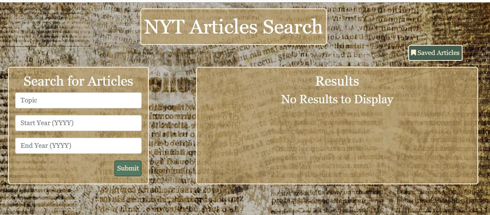

# React New York Times Search

### A React application that searches the New York Times API

This full stack MERN application uses react structure to allow a user to search ("/") the New York Times API by topic and time frame and save ("/saved"), using Mongo, the articles' headlines, dates, snippets (if they are included in the API), and url link to the article.

### Dependencies

Express npm is used to organize the proper architecture, body-parser for middleware, mongo npm for ease in handling the database, and axios for the New York Times API call and routing in the front end.  Express router is also used on the server side. With this application, a user may write to the database (save an article), read the db ("/saved"), and delete from the db (also on the "/saved" page).

### Components and State

This application uses boostrap and follows that structure, using container, row, column, form, and button components to create an attractive framework for page components.  The page paths are rendered with the the help of react-router-dom in the app component and with react-dom in the index file.  The home page uses state for user input and for the response from the New York Times API.  The "Saved Articles" page uses state for the response from the call from the database. 

##### About this Application

Create-react-app sets up the proper client-server structure.  The user can search articles in the New York Times API. Database and file components were added so that the user could save articles, adding utility to the application.
